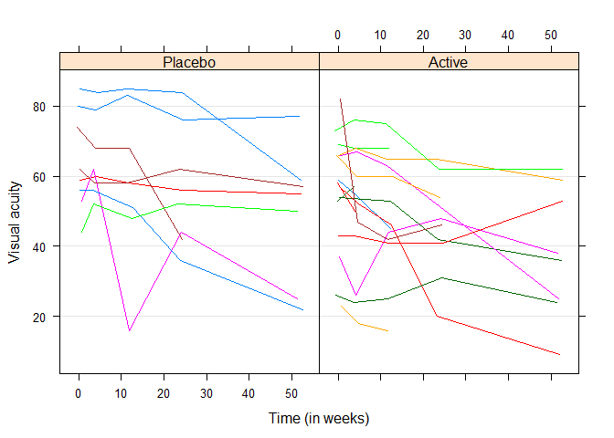

# Fitting Linear Models with Homogeneous Variance
MK  
`r format(Sys.Date())`  

**The Data**  
Age-Related Macular Degeneration (ARMD) Trial: A clinical trial comparing
several doses of interferon-a and placebo in patients with ARMD. Visual acuity
of patients participating in the trial was measured at baseline and at four postrandomization
timepoints. The resulting data are an example of longitudinal data
with observations grouped by subjects.   

```r
data(armd.wide, package = "nlmeU")
head(armd.wide)
```

```
##   subject lesion line0 visual0 visual4 visual12 visual24 visual52 treat.f
## 1       1      3    12      59      55       45       NA       NA  Active
## 2       2      1    13      65      70       65       65       55  Active
## 3       3      4     8      40      40       37       17       NA Placebo
## 4       4      2    13      67      64       64       64       68 Placebo
## 5       5      1    14      70      NA       NA       NA       NA  Active
## 6       6      3    12      59      53       52       53       42  Active
##   miss.pat
## 1     --XX
## 2     ----
## 3     ---X
## 4     ----
## 5     XXXX
## 6     ----
```

In the ARMD data, we are mainly interested in the effect of treatment on the visual
acuity measurements  

```r
data(armd.wide, armd0, package = "nlmeU")
library(lattice)
armd0.subset <- subset(armd0, as.numeric(subject) %in% seq(1, 240, 10))
xy1 <- xyplot(visual ~ jitter(time) | treat.f, groups = subject, data = armd0.subset, type = "l", lty = 1)
update(xy1,xlab = "Time (in weeks)",ylab = "Visual acuity",grid = "h")
```

<!-- -->

```r
#detach(package:lattice)
```
Based on the plots shown several observations can be made:    

* In general, visual acuity tends to decrease in time. This is in agreement with the
remark made in Sect. 2.2 that patients with ARMD progressively lose vision.  

* For some patients, a linear decrease of visual acuity over time can be observed,
but there are also patients for whom individual profiles strongly deviate from a
linear trend.  

* Visual acuity measurements adjacent in time are fairly well correlated, with the
correlation decreasing with an increasing distance in time.  

* Visual acuity at baseline seems to, at least partially, determine the overall level
of the post-randomization measurements.  

* There are patients for whom several measurements are missing.  


